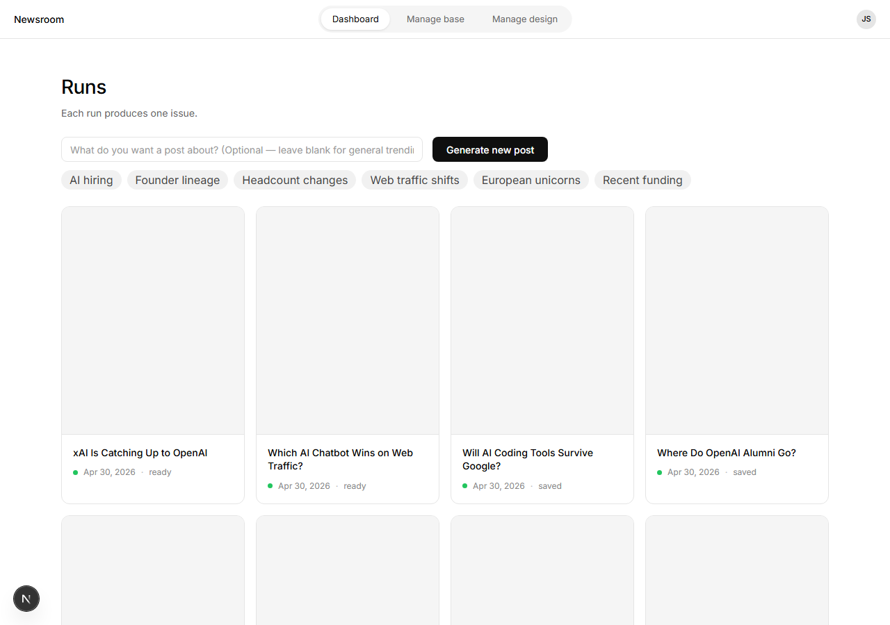
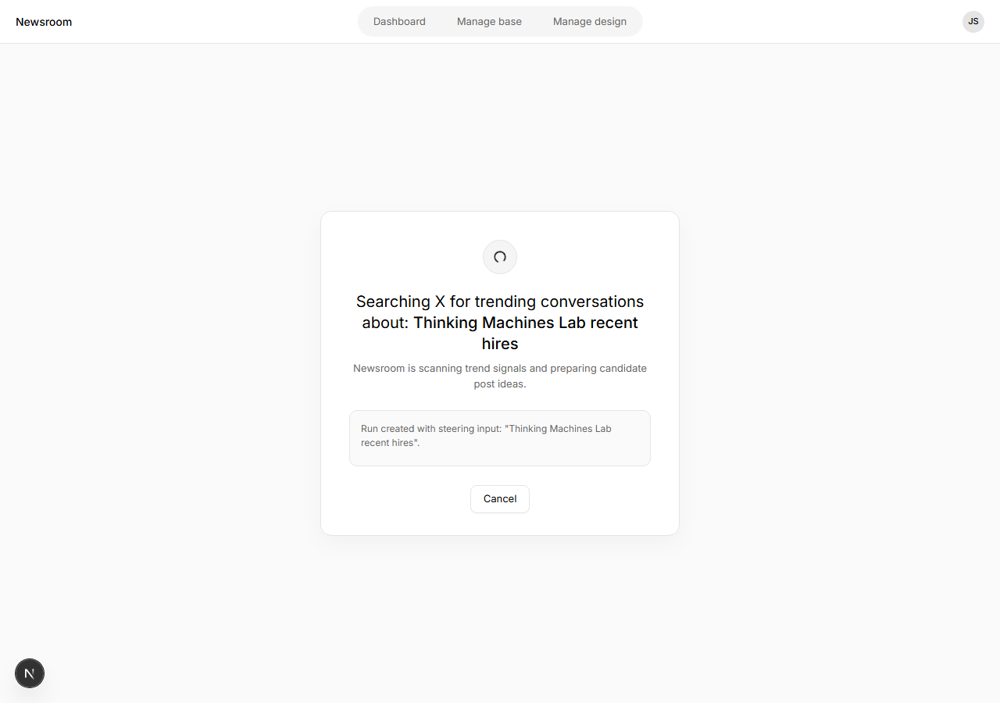
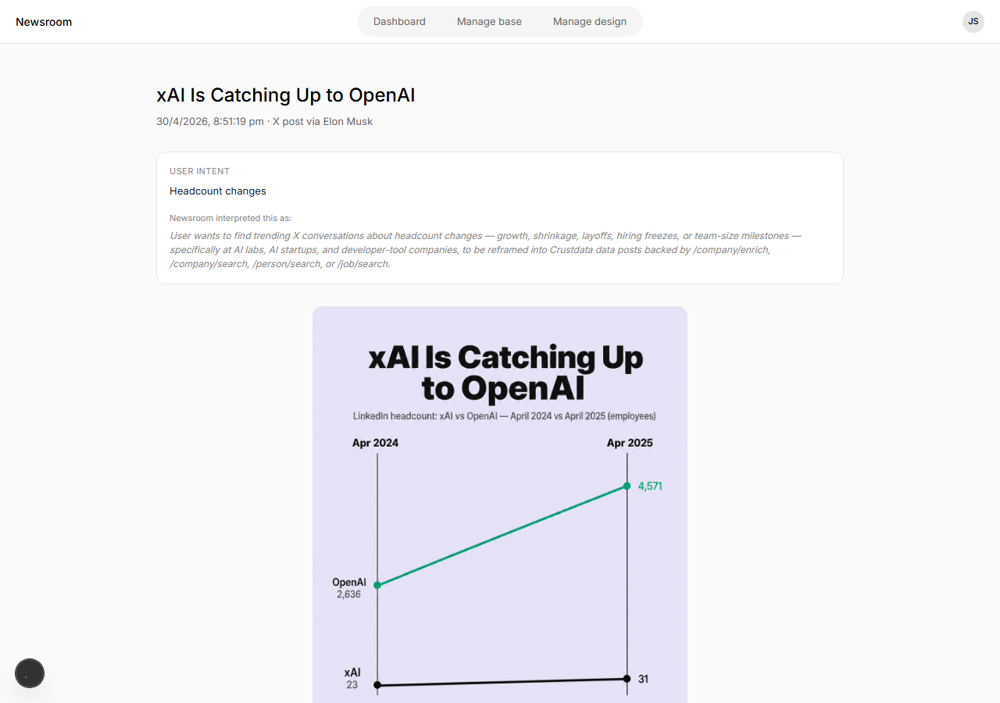

# Newsroom: user-steered topic discovery via Dashboard chat box

## Summary

This PR adds an optional Dashboard steering input so each run can be guided by a fresh user intent instead of reusing the same static `base.md`-only discovery query.

- Adds a single-row Dashboard input beside the existing `Generate new post` button.
- Shows static suggestion chips, with up to two recent steerings prepended when available.
- Sends optional `steering_input` through run creation, Stage 1 discovery, Stage 2 scoring/reframing, and run persistence.
- Adds Stage 1 forced tool use for `submit_grok_query`, including `steering_acknowledged` and `time_window_days`.
- Tracks topic history so Stage 1 can avoid repeating obvious angles for recently used steerings.
- Displays active steering on the Trend Discovery waiting page.
- Displays user intent and Newsroom's interpretation on the Run Detail page.

## Screenshots

Screenshots captured locally:

- `docs/screenshots/dashboard-steering-input.png` - Dashboard with the chat-box steering input and suggestion chips.
- `docs/screenshots/trend-discovery-steering-waiting.png` - Trend Discovery Waiting page showing `Searching X for trending conversations about: Thinking Machines Lab recent hires`.
- `docs/screenshots/run-detail-steering.png` - Run Detail page showing both `User intent` and `Newsroom interpreted this as:`.

## Verification

- `npm test`
- `npm run build`
- Dashboard empty input keeps the general trending flow.
- Dashboard steered input records `steering_input` on the run.
- Suggestion chip click populates the input and submits that steering.
- Recent steerings appear before static chips after steered runs exist.
- Long steering input is truncated to 200 characters server-side.
- Stage 1 token logs still record Anthropic cache usage fields.
